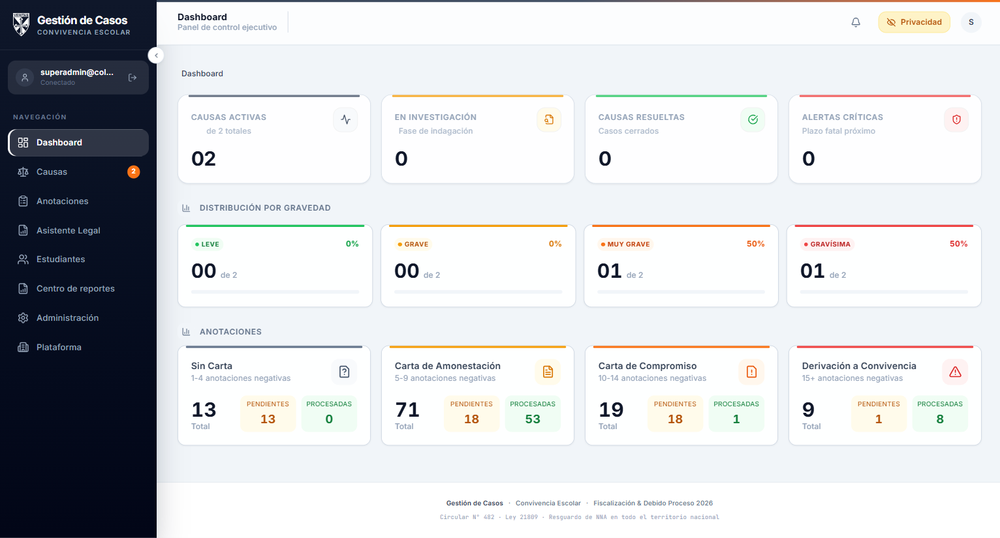
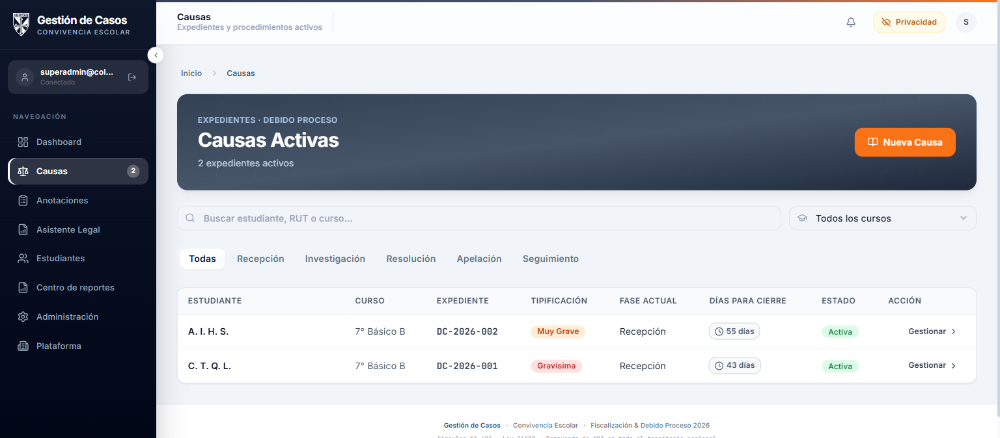
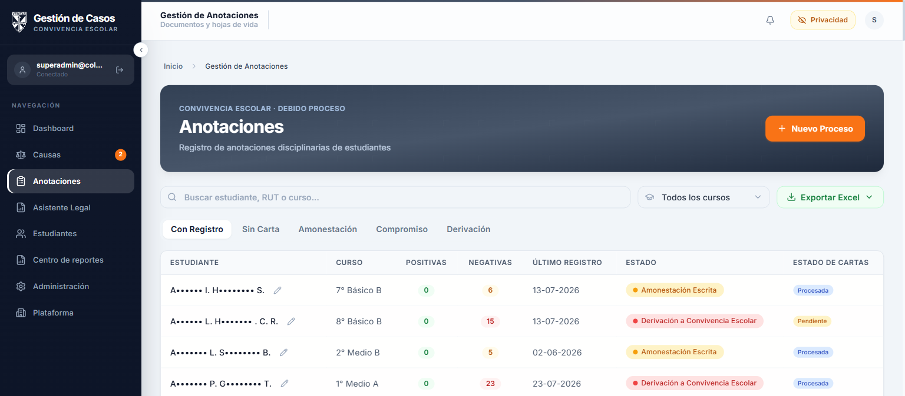
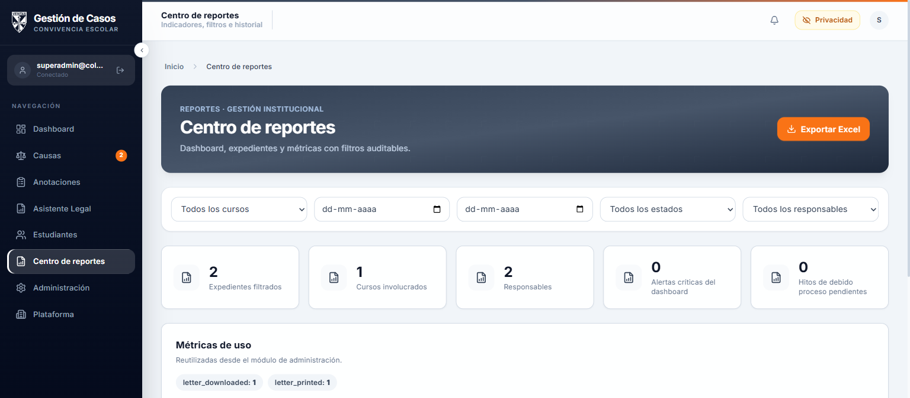
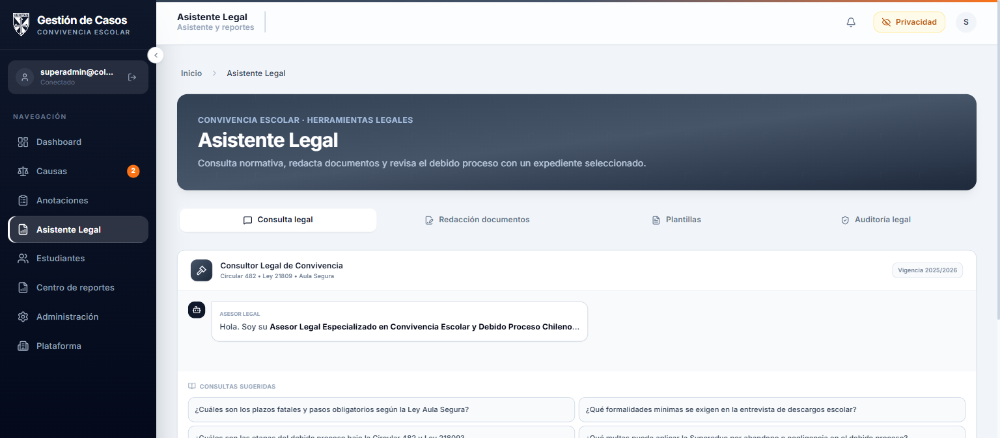
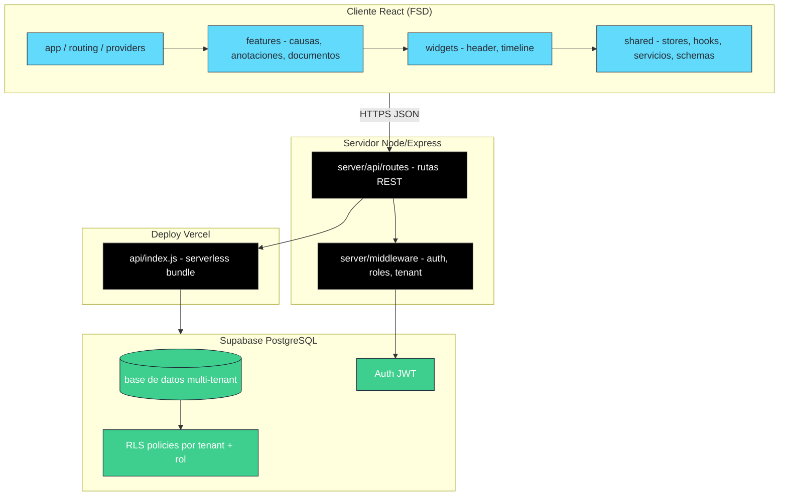

<div align="center">

  

  <h1>Sistema Integral de Convivencia Escolar</h1>

  <p><strong>Plataforma SaaS multi-tenant para la gestión integral del debido proceso disciplinario en establecimientos educacionales chilenos.</strong></p>

  <!-- Badges dinámicos -->
  <p>
    <a href="https://github.com/Hluengo/sistema-integral-convivencia-escolar/actions/workflows/ci.yml">
      
    </a>
    <a href="https://github.com/Hluengo/sistema-integral-convivencia-escolar/actions/workflows/lighthouse.yml">
      
    </a>
    <a href="https://github.com/Hluengo/sistema-integral-convivencia-escolar/blob/main/LICENSE">
      
    </a>
  </p>
  <p>
    
    
    
    
    
    
    
    
  </p>
  <p>
    <a href="https://gestiondecasos.vercel.app">🌐 Ver demo</a> ·
    <a href="#caracteristicas">✨ Características</a> ·
    <a href="#capturas">📸 Capturas</a> ·
    <a href="#arquitectura">🏗️ Arquitectura</a> ·
    <a href="#instalacion">🚀 Instalación</a>
  </p>

</div>

---

## 📌 Descripción

El **Sistema Integral de Convivencia Escolar** centraliza el trabajo de equipos de convivencia, inspectoría, dirección y administración escolar. Apoya el **debido proceso disciplinario** en el contexto de la **Circular 482 (2018)** y la **Ley 21.809 (2026)**. La revisión jurídica y las decisiones institucionales siguen siendo responsabilidad del establecimiento.

Permite registrar anotaciones, clasificar conductas mediante el sistema **RICE** (Leve, Grave, Muy Grave, Gravísima), gestionar expedientes con bitácora y checklist, analizar PDFs disciplinarios, generar cartas y documentos institucionales, y recibir asistencia editorial mediante inteligencia artificial.

Diseñado como **SaaS multi-tenant**, aísla los datos de cada establecimiento educacional mediante **RLS policies** y autenticación JWT con Supabase Auth.

---

## 🛡️ Módulo de Seguridad y Cumplimiento

Este proyecto maneja **datos de estudiantes (NNA)**, por lo que la seguridad es prioridad absoluta:

- **RLS policies** multi-tenant por rol y establecimiento.
- **JWT verification** en todas las rutas API sensibles.
- **Anonimización de datos personales** antes de enviar a APIs de IA.
- **Sanitización de inputs** de usuario para prevenir XSS e inyección de prompts.
- **Service role key nunca expuesta al cliente**.
- **UUIDs obligatorios** para estudiantes y causas.
- Cumplimiento normativo con **Circular 482** y **Ley 21.809**.
- **Modo privacidad** integrado que enmascara nombres y RUT en toda la interfaz.

> 🔍 Consulta [`docs/architecture/security.md`](docs/architecture/security.md), las reglas inmutables en [`docs/CONSTITUTION.md`](docs/CONSTITUTION.md) y la revisión de seguridad en [`docs/reviews/security-review.md`](docs/reviews/security-review.md). La seguridad técnica no reemplaza las obligaciones institucionales de resguardo, revisión jurídica y gestión de accesos.

---

## ✨ Características

| Área                    | Funcionalidad                                                                                                                             |
| ----------------------- | ----------------------------------------------------------------------------------------------------------------------------------------- |
| 📋 **Expedientes**      | Gestión de casos disciplinarios con **39 estados** organizados en 5 fases: Recepción, Investigación, Resolución, Apelación y Seguimiento. |
| 📝 **Anotaciones RICE** | Clasificación de severidad, filtros, ficha individual, adjuntos PDF y análisis automatizado.                                              |
| 📄 **Análisis de PDFs** | Extracción de texto, detección de anotaciones, coincidencia con estudiantes y sugerencia de etapa/carta.                                  |
| ✅ **Debido proceso**   | Bitácora y checklist legal para garantizar el cumplimiento normativo en cada etapa.                                                       |
| ✉️ **Cartas**           | Amonestación, compromiso y derivación con editor, impresión, trazabilidad y registro de cartas físicas.                                   |
| 🤖 **Asistencia IA**    | OpenRouter (texto) y Gemini (informes/borradores) usando plantillas y antecedentes del expediente.                                        |
| 🏢 **Multi-tenant**     | Aislamiento de datos por establecimiento mediante `tenant_id` + RLS.                                                                      |
| 👥 **Roles**            | `admin`, `direccion`, `convivencia`, `inspectoria`, `profesor_jefe`, `teacher`, `inspector`, `staff` y `superadmin`.                      |
| 📊 **Reportes**         | Dashboard ejecutivo, centro de reportes, exportación Excel y métricas auditables.                                                         |
| 📚 **Administración**   | Miembros, invitaciones, cursos, estudiantes, importación Excel y configuración institucional.                                             |
| 🌐 **Multi-colegio**    | Plataforma para superadministradores con selección explícita del establecimiento.                                                         |
| 📱 **Accesible**        | Interfaz responsive, modo privacidad y navegación accesible en español chileno.                                                           |

---

## 📸 Capturas

> Las capturas fueron tomadas con el **modo privacidad activado** para proteger los datos de estudiantes (NNA).

|             Dashboard ejecutivo              |          Causas y expedientes          |
| :------------------------------------------: | :------------------------------------: |
|  |  |

|                 Anotaciones RICE                 |             Centro de reportes             |
| :----------------------------------------------: | :----------------------------------------: |
|  |  |

|                     Asistente Legal                      |
| :------------------------------------------------------: |
|  |

---

## 🏗️ Arquitectura



### Dual entry point

| Entry                 | Uso                                                  |
| --------------------- | ---------------------------------------------------- |
| `server/index.ts`     | Servidor de desarrollo local con Express + Vite HMR. |
| `server/api/index.ts` | Entrada serverless de Vercel para producción.        |

`api/index.js` es un artefacto generado por `npm run build`; las rutas se implementan una sola vez en `server/api/routes/`.

> ⚠️ Al modificar rutas API, actualizar **ambos entry points**.

### Estructura Feature-Sliced Design (FSD)

- `app/` — Inicialización, routing y providers.
- `features/` — Funcionalidades completas (causas, anotaciones, documentos).
- `widgets/` — Widgets reutilizables.
- `shared/` — Stores, hooks, servicios, schemas Zod y tipos.
- `components/` — Componentes legacy con barrels de retrocompatibilidad.

Para más detalles, revisa:

- [`docs/architecture/project-overview.md`](docs/architecture/project-overview.md)
- [`docs/CONSTITUTION.md`](docs/CONSTITUTION.md)
- [`docs/engineering/HANDBOOK.md`](docs/engineering/HANDBOOK.md)

---

## 📊 Informes de calidad

| Métrica           | Valor                                                                                                                                                                                                                                                               |
| ----------------- | ------------------------------------------------------------------------------------------------------------------------------------------------------------------------------------------------------------------------------------------------------------------- |
| ⚙️ **CI**         | [](https://github.com/Hluengo/sistema-integral-convivencia-escolar/actions/workflows/ci.yml)                                 |
| 🚦 **Lighthouse** | [](https://github.com/Hluengo/sistema-integral-convivencia-escolar/actions/workflows/lighthouse.yml) |
| ✅ **Tests**      | 340 tests · 77 suites                                                                                                                                                                                                                                               |
| 📈 **Cobertura**  | ~56% líneas                                                                                                                                                                                                                                                         |
| 🔐 **Seguridad**  | `npm audit` 0 vulnerabilidades                                                                                                                                                                                                                                      |

> Los badges de CI y Lighthouse se actualizan automáticamente con cada push. Los informes de Lighthouse se generan en `.lighthouseci/`.

---

## 🧱 Stack tecnológico

| Capa          | Tecnología                  | Versión        |
| ------------- | --------------------------- | -------------- |
| Frontend      | React + TypeScript          | 19.0.1 / 5.8.2 |
| Build         | Vite                        | 6.4.3          |
| CSS           | Tailwind CSS v4             | 4.1.14         |
| Estado global | Zustand                     | 5.0.14         |
| Server state  | TanStack React Query        | 5.101.2        |
| Formularios   | react-hook-form + Zod       | 7.82.0 / 4.4.3 |
| Backend dev   | Express + tsx               | 4.21.2         |
| Backend prod  | Vercel Serverless (esbuild) | —              |
| Base de datos | Supabase PostgreSQL         | 17.6.1         |
| Autenticación | Supabase Auth               | —              |
| IA            | OpenRouter + Gemini         | —              |
| Documentos    | docx / pdfjs-dist           | —              |
| Monitoring    | Sentry + PostHog            | —              |
| Tests         | node:test + Playwright      | —              |

---

## 🚀 Instalación

### Requisitos previos

- **Node.js 22** (ver `.nvmrc`)
- Cuenta en **Supabase**
- API key de **OpenRouter** y **Gemini**
- (Opcional) Cuenta en **Vercel** para deploy

### Pasos

```bash
# 1. Clonar el repositorio
git clone https://github.com/Hluengo/sistema-integral-convivencia-escolar.git
cd sistema-integral-convivencia-escolar

# 2. Instalar dependencias
npm install

# 3. Configurar variables de entorno
cp .env.example .env.local
# Editar .env.local con tus credenciales reales

# 4. Ejecutar en modo desarrollo
npm run dev
```

La aplicación queda disponible en `http://localhost:3001`. Vite utiliza el puerto `3002` para HMR. El servidor expone `GET /api/health` para comprobar disponibilidad.

### Variables de entorno

Usa `.env.example` como plantilla. Las variables dependen de las funciones habilitadas:

<details>
<summary><strong>Ver tabla de variables de entorno</strong></summary>

| Variable                                                         | Descripción                                      |
| ---------------------------------------------------------------- | ------------------------------------------------ |
| `VITE_SUPABASE_URL`                                              | URL del proyecto Supabase                        |
| `VITE_SUPABASE_PUBLISHABLE_KEY`                                  | Publishable key pública de Supabase              |
| `SUPABASE_URL`                                                   | URL usada por operaciones server-side            |
| `SUPABASE_SERVICE_ROLE_KEY`                                      | Operaciones privilegiadas; solo servidor         |
| `SUPABASE_JWT_SECRET`                                            | Compatibilidad con proyectos que usan JWT HS256  |
| `OPENROUTER_API_KEY`                                             | Mejora, adaptación y asistencia de texto         |
| `GEMINI_API_KEY`                                                 | Informes y borradores documentales               |
| `DEFAULT_TENANT_ID`                                              | Tenant por defecto para operaciones configuradas |
| `ALLOWED_ORIGINS`                                                | Orígenes CORS separados por coma                 |
| `UPSTASH_REDIS_REST_URL` / `UPSTASH_REDIS_REST_TOKEN`            | Rate limiting persistente en serverless          |
| `VITE_ALLOW_LOCAL_DEMO`                                          | Demo sin login, solo desarrollo                  |
| `VITE_SENTRY_DSN`                                                | Error tracking                                   |
| `VITE_POSTHOG_KEY` / `VITE_POSTHOG_HOST`                         | Analytics                                        |
| `VITE_NOTIFICATIONS_REALTIME`                                    | Notificaciones Realtime                          |
| `VITE_APP_MEMBERSHIPS_ENABLED` / `VITE_APP_MEMBERSHIPS_ENFORCED` | Control de membresías                            |
| `E2E_BASE_URL`, `E2E_STAFF_*`, `E2E_SUPERADMIN_*`                | Configuración de Playwright                      |

</details>

> 🔒 **Nunca commitear** `.env.local` ni `.env.production`. Ver `docs/CONSTITUTION.md`.

Las claves `SUPABASE_SERVICE_ROLE_KEY`, `SUPABASE_JWT_SECRET`, `OPENROUTER_API_KEY` y `GEMINI_API_KEY` no deben llegar al bundle del navegador.

---

## 🛠️ Comandos

| Comando                  | Descripción                                            |
| ------------------------ | ------------------------------------------------------ |
| `npm run dev`            | Servidor Express + Vite HMR (puertos 3001 / 3002)      |
| `npm run build`          | Build completo: cliente Vite + servidor esbuild        |
| `npm run build:web`      | Build solo del cliente                                 |
| `npm run start`          | Iniciar servidor de producción desde `dist/server.cjs` |
| `npm run lint`           | TypeScript check + ESLint                              |
| `npm run typecheck`      | Verificación estricta de tipos (`tsc --noEmit`)        |
| `npm run test`           | Tests unitarios con el runner nativo de Node           |
| `npm run test:coverage`  | Tests unitarios con cobertura nativa de Node           |
| `npm run test:e2e`       | Tests end-to-end con Playwright                        |
| `npm run format`         | Formatear código con Prettier                          |
| `npm run security-audit` | Auditoría de dependencias (`npm audit`)                |
| `npm run ci`             | Lint + test + build:web + security audit               |

---

## 🧪 Testing

El proyecto incluye tests unitarios con **node:test** y tests E2E con **Playwright**.

```bash
# Tests unitarios
npm run test

# Tests E2E
npm run test:e2e

# Cobertura
npm run test:coverage
```

> Antes de commitear, ejecutar siempre: `npm run lint && npm run test && npm run build:web`.

---

## ☁️ Deploy

### Vercel

```bash
npx vercel login
npx vercel        # Preview
npx vercel --prod # Producción
```

Configurar en el dashboard de Vercel las variables de entorno requeridas:

- `VITE_SUPABASE_URL`
- `VITE_SUPABASE_PUBLISHABLE_KEY`
- `SUPABASE_JWT_SECRET`
- `SUPABASE_SERVICE_ROLE_KEY`
- `OPENROUTER_API_KEY`
- `GEMINI_API_KEY`

### Supabase Migrations

Las migraciones activas se encuentran en `supabase/migrations/`. No modifiques migraciones ya aplicadas: crea una nueva migración incremental.

Aplicar con Supabase CLI:

```bash
supabase db push
```

Más detalles en [`docs/DEPLOY.md`](docs/DEPLOY.md).

---

## 🗺️ Roadmap

El roadmap vivo está en [`docs/architecture/future-roadmap.md`](docs/architecture/future-roadmap.md). Entre los pendientes se encuentran:

- React Router / deep linking
- Mayor cobertura de tests
- Exportación avanzada de reportes
- Modo offline
- Futuros módulos PIE, UTP y portal de apoderados

---

## 🤝 Contribución

1. Lee [`docs/CONSTITUTION.md`](docs/CONSTITUTION.md) y [`docs/engineering/HANDBOOK.md`](docs/engineering/HANDBOOK.md).
2. Crea una rama desde `main`.
3. Escribe código siguiendo las convenciones del proyecto (TypeScript estricto, UI en español chileno, tests co-located).
4. Ejecuta `npm run lint && npm run test && npm run build:web` antes de enviar tu PR.
5. Describe tu cambio en español con un mensaje de commit claro.

---

## 📄 Licencia

```text
SPDX-License-Identifier: Apache-2.0
```

Este proyecto está licenciado bajo la **Apache License 2.0**.

---

<div align="center">
  <p><em>Construido para proteger el debido proceso y mejorar la convivencia escolar en Chile.</em></p>
  <p>
    <a href="https://github.com/Hluengo/sistema-integral-convivencia-escolar/issues">Reportar un problema</a> ·
    <a href="https://github.com/Hluengo/sistema-integral-convivencia-escolar/discussions">Discusiones</a>
  </p>
</div>
