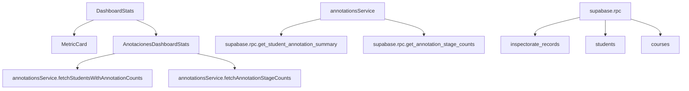
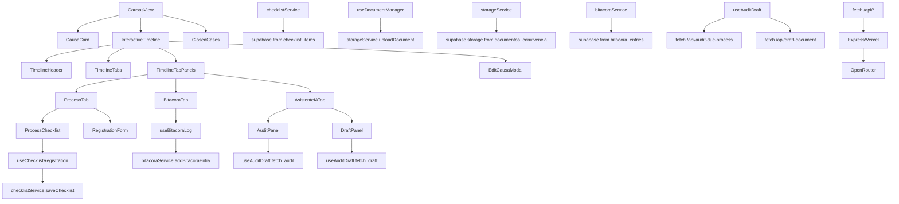
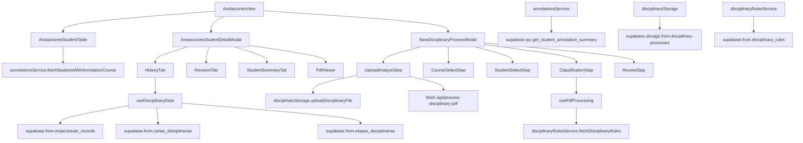
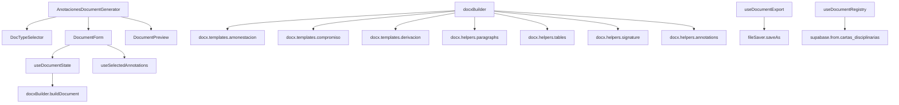
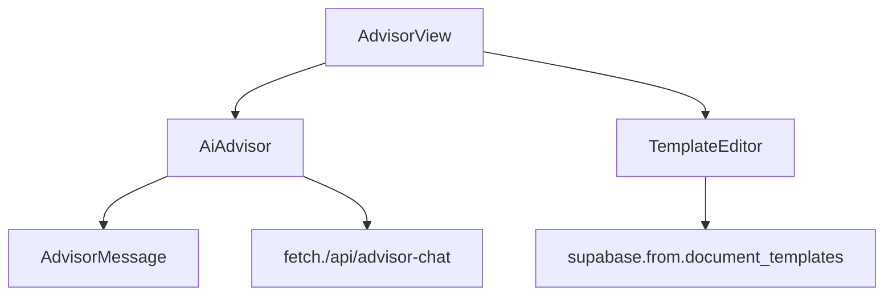
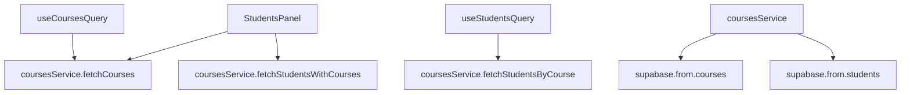

# Dependency Graph — Componentes → Servicios

> Diagramas Mermaid de dependencias entre capas del frontend.

## 1. Dashboard View

## 2. Causas View

## 3. Anotaciones View

## 4. Document Generator

## 5. AI Advisor

## 6. Students Panel

