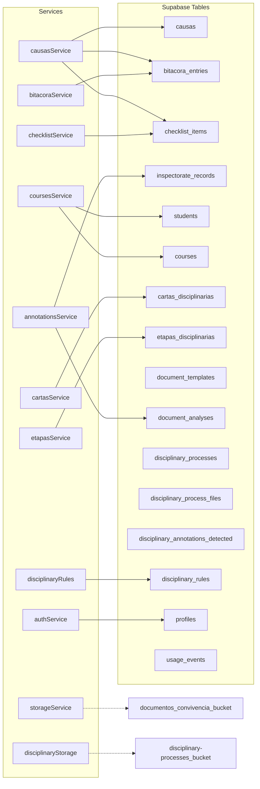
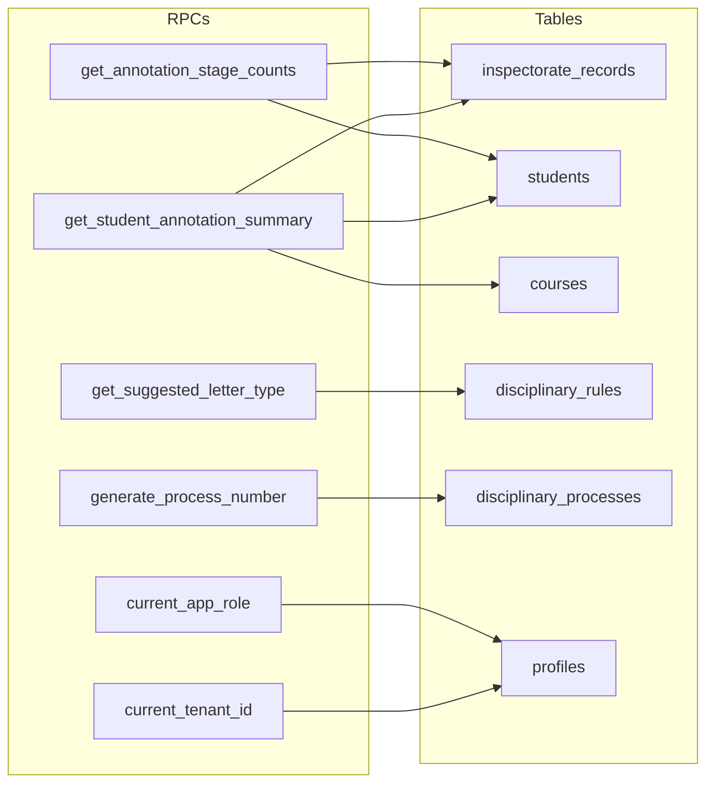

# Dependency Graph — Servicios → Tablas

> Mapa de qué servicios escriben/leen qué tablas de Supabase.

## Services Map



## Read/Write Matrix

| Service | Tablas que Lee | Tablas que Escribe |
|---------|---------------|-------------------|
| causasService | causas, bitacora_entries, checklist_items | causas, bitacora_entries, checklist_items |
| bitacoraService | bitacora_entries | bitacora_entries |
| checklistService | checklist_items | checklist_items |
| annotationsService | inspectorate_records, students, courses | inspectorate_records, document_analyses |
| coursesService | courses, students | — |
| cartasService | cartas_disciplinarias | — |
| etapasService | etapas_disciplinarias | — |
| disciplinaryRules | disciplinary_rules | — |
| authService | profiles | — |
```

## Supabase RPCs


