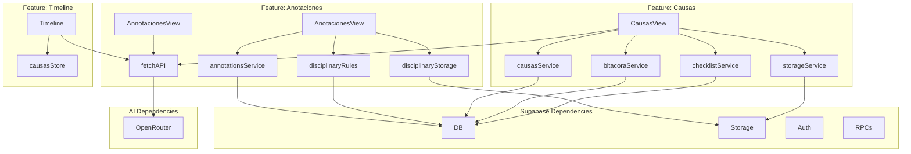

# Dependency Graph — Full System Map

> Mapa completo del sistema mostrando todas las dependencias entre capas.

## Complete System

```mermaid
graph TD
    %% Layer 1: UI
    subgraph "UI Layer (React Components)"
        Dashboard
        CausasView
        Timeline
        AnotacionesView
        DocumentosView
        StudentsPanel
        AdvisorView
    end

    %% Layer 2: State
    subgraph "State Layer"
        authStore
        causasStore
        uiStore
        toastStore
        ReactQuery[courses + students]
        useReducer
    end

    %% Layer 3: Hooks
    subgraph "Hooks Layer"
        useCausasPersistence
        useTimelineController
        useChecklistRegistration
        useBitacoraLog
        useDocumentManager
        useAuditDraft
        usePdfProcessing
        useTextImprovement
    end

    %% Layer 4: Services
    subgraph "Services Layer"
        causasService
        bitacoraService
        checklistService
        annotationsService
        coursesService
        cartasService
        etapasService
        storageService
        disciplinaryStorage
        disciplinaryRules
        authService
    end

    %% Layer 5: Supabase
    subgraph "Supabase Layer"
        Auth[Supabase Auth]
        DB[(PostgreSQL)]
        Storage[Storage Buckets]
        RPCs
    end

    %% Layer 6: External
    subgraph "External APIs"
        OpenRouter
        Sentry
        PostHog
    end

    %% Connections: UI → State
    Dashboard --> causasStore
    Dashboard --> uiStore
    CausasView --> causasStore
    CausasView --> uiStore
    CausasView --> ReactQuery
    Timeline --> causasStore
    AnotacionesView --> uiStore
    AdvisorView --> uiStore

    %% Connections: State → Hooks
    causasStore --> useCausasPersistence
    causasStore --> useTimelineController
    causasStore --> useChecklistRegistration
    causasStore --> useBitacoraLog
    causasStore --> useDocumentManager
    causasStore --> useAuditDraft

    %% Connections: Hooks → Services
    useCausasPersistence --> causasService
    useCausasPersistence --> bitacoraService
    useCausasPersistence --> checklistService
    useTimelineController --> useChecklistRegistration
    useTimelineController --> useBitacoraLog
    useTimelineController --> useDocumentManager
    useDocumentManager --> storageService
    usePdfProcessing --> disciplinaryStorage
    usePdfProcessing --> disciplinaryRules
    useAuditDraft --> fetchAPI[fetch /api/*]
    useTextImprovement --> fetchAPI

    %% Connections: Services → Supabase
    causasService --> DB
    bitacoraService --> DB
    checklistService --> DB
    annotationsService --> DB
    annotationsService --> RPCs
    coursesService --> DB
    cartasService --> DB
    etapasService --> DB
    storageService --> Storage
    disciplinaryStorage --> Storage
    disciplinaryRules --> DB
    authService --> Auth

    %% External
    fetchAPI --> Express[Express/Vercel API]
    Express --> OpenRouter
    Express --> DB
    Express --> Auth
```

## Feature Dependencies

```mermaid
graph TD
    subgraph "Feature: Anotaciones"
        AnotacionesView --> annotationsService
        AnotacionesView --> disciplinaryStorage
        AnotacionesView --> disciplinaryRules
        AnnotacionesView --> fetchAPI
    end

    subgraph "Feature: Causas"
        CausasView --> causasService
        CausasView --> bitacoraService
        CausasView --> checklistService
        CausasView --> storageService
        CausasView --> fetchAPI
    end

    subgraph "Feature: Timeline"
        Timeline --> causasStore
        Timeline --> fetchAPI
    end

    subgraph "Supabase Dependencies"
        DB
        Storage
        Auth
        RPCs
    end

    subgraph "AI Dependencies"
        OpenRouter
        fetchAPI
    end

    annotationsService --> DB
    disciplinaryStorage --> Storage
    disciplinaryRules --> DB

    causasService --> DB
    bitacoraService --> DB
    checklistService --> DB
    storageService --> Storage

    fetchAPI --> OpenRouter
```
